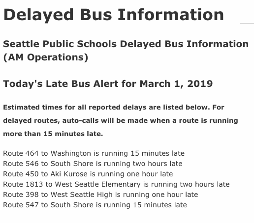
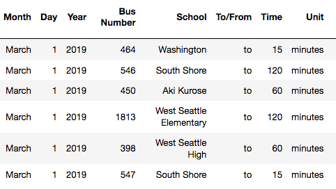
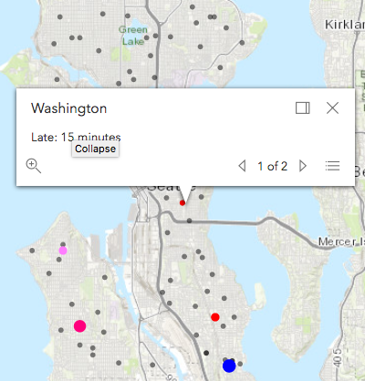

<!-- $theme: default -->

# Introduction to Regular Expressions

## Learning Goals
Be able to answer the following questions:  
- What is a regular expression?
- How can I write a regular expression to match on a specific pattern?
- How can I use regular expressions to speed up my development workflow?

---

# Introduction  

Regular expressions are a great tool for working with text. Using regular expressions (AKA Regex) you can **identify and process patterns** of text. 

Regulate Expressions can make a variety of tasks much easier, like **validating that a phone number** or **zip code** is in the right format.

You will likely only use a limited number of expressions during your time at Ada, but understanding Regex can simplify your code, and Regex is useful across multiple languages.

---

# Use Case

### Creating a database of Late Seattle Public School Buses




---

from this web scraped text: 

```ruby
<p>Route 464 to Washington is running 15 minutes late<br/>
Route 546 to South Shore is running two hours late<br/>
Route 450 to Aki Kurose is running one hour late<br/>
Route 1813 to West Seattle Elementary is running two hours late<br/>
Route 398 to West Seattle High is running one hour late<br/>
Route 547 to South Shore is running 15 minutes late<br/>
Route 630 to Queen Anne is running 15 minutes late<br/>
Route 415 to World School is running 35 minutes late<br/>
Route 578 to TOPS is running 15 minutes late</p>
```

to this collection of strings:

```ruby
late_buses = ['Route 464 to Washington is running 15 minutes late',
'Route 546 to South Shore is running two hours late',
'Route 450 to Aki Kurose is running one hour late',
'Route 1813 to West Seattle Elementary is running two hours late',
'Route 398 to West Seattle High is running one hour late',
'Route 547 to South Shore is running 15 minutes late']


```   
---

to this database and visualization:

database|visualization
:---:|:---:
   | 

---
## Regular Expression Basics

Like `String` and `Integer`, a regular expression is a data type in Ruby, defining a pattern of characters.  

You can form a Regex variable like this:

```ruby
pattern = /ada/
```
`/ada/` is a RegEx literal representing a pattern matching any String with the letters "ada" inside it.  The two forward slashes indicate a regular expression, or a pattern of text.   Anything put between the slashes forms the pattern of text we can match strings against.  

---
# pattern.match(string)


```ruby
pattern = /ada/
```

You can think of a Regular Expression like a String, but instead of specifying a specific list of characters by enclosing  them with quotes (""), instead it defines a **pattern** of characters by enclosing  them with forward slashes.

You can test a String against the regular expression with the Regex's `match` method.  The `match` method compares the string to the pattern, character-by-character and will return a `MatchData` object upon a match and `nil` if the String does not match the pattern.  It's important to note that `match` will return a `MatchData` object if any substring matches the pattern, not necessarily the entire String.

---

```ruby
pattern = /ada/
```

For example:

```ruby
pattern = /ada/
if pattern.match("ada lovelace")
  puts "The String has ada in it!"
else
  puts "It doesn't match"
end
```
The above snippet will print out "The String has ada in it!"  

---

# =~

Regular Expressions can also be compared using the `=~` operator.  
The `=~` operator returns the index of the first match in the string .
For example:  

```ruby
pattern =~ 'ada'	# => 0
pattern =~ "learn at ada academy." # => 9 
```
What will the following return?

```ruby
pattern =~ "I love ada developers academy"
pattern =~ "Ada Developers Academy"
pattern =~ "Seattle's a great city"

pattern.match('ada')
pattern.match('hello world')

```

---
## match vs. =~

Both `match` and `=~` will return a truthy result if any substring matches the pattern.  

## Beyond the basics

If you want to match a pattern exactly, the regular expression needs to be more specific using special characters to indicate the start and end of the string. _More on this later..._

If you wanted to match either "Ada" or "ada."  To handle both lower and upper case "Ada," we need to provide our pattern options to match against.  To provide a list of possible characters we can use **Character sets.**

---

# Character Sets

A **character set**, also called a **character class** is a way to tell the regex engine to match only one out of several characters.  We define a character set with square brackets.  For example `/[Ss]/` will match both capital and lowercase S.  Combining the character set with the previous larger literal, `[Aa]da` will match both "Ada" and "ada".  

If you want the **whole** regex to ignore case you can use the i flag:

```ruby
pattern = /ada/i

pattern =~ 'ADA' # => truthy
pattern =~ 'aDA' # => truthy
pattern =~ 'aDa' # => truthy
```

---

# Character Sets (continued)

You can also adjust the character set to accept a range of characters.  For example:  
- `/[A-Z]/`  will accept a single character in the range A to Z (must be capitalized)
- `/[0-9]/` will accept a single digit.  
- `/[A-Za-z]/` or `/[A-Z]/i` will accept any alphabetic characters.

![/[A-Aa-z]/](images/regex1.png)

### Practice

How could you match any alphanumeric digit like "a", "W", or "0"?

<details>
  <summary>
  Check your answer here
  </summary>
	
  ```ruby
  pattern = /[A-Za-z0-9]/
  pattern = /[A-Z0-9]/i
  ```
</details>

# The Wildcard and Quantifiers

Sometimes you will want to accept any character.  For that purpose you can use the _wildcard_ character, a period (`.`).

Another common need is for characters that are optional or can repeat. For this there are several helpful symbols called _quantifiers_: `*`, `+` and `?`.

These characters are summarized in the following table.

---

Character | Meaning            | Example
---       | ---                | ---
`.`       | Any one character  | `/a.a/` matches `ada`, `ava`, and `a!a`
`*`       | Preceding token may occur **zero** or more times | `/ad*a/` matches `aa`, `ada`, and `adddda`<br><br>`/[0-9]*/` matches `1`, `345`, and the empty string<br><br>`.*` matches any string
`+`       | Preceding token may occur **one** or more times. | `/ad+a/` matches `ada` and `adddda` but **not** `aa`<br><br>`/[0-9]+/` matches `1` and `345` but **not** the empty string<br><br>`.+` matches any string **except for** the empty string
`?`       | Preceding token is optional (may occur zero or one times) | `/ad?a/` matches `aa` and `ada`<br><br>`/[0-9]/` matches `2` and the empty string but not `27` or `356`<br><br>`.?` matches any one character or the empty string

---
## Practice

Write a regular expression to match a valid email of form `name@domain.tld`
- Matches `dee@adadev.org`, `adalovelace@gmail.com`, `magictavern@puppies.supplies`
- Rejects `dan@adadev.`, `charles.com`, `@adadev.org`, `sarah@.org`
- Use `\.` for a literal period (more on this later)


<details>
  <summary>
  Check your answer here
  </summary>
	
  ```ruby
  pattern = /.+@.+\..+/
  ```
</details>